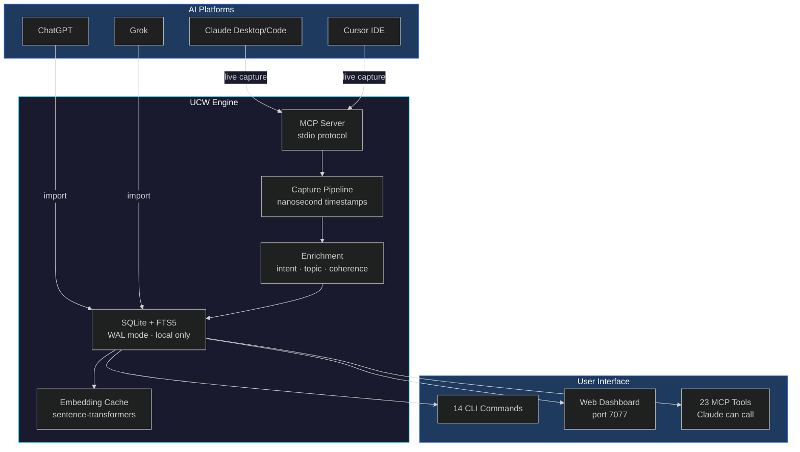
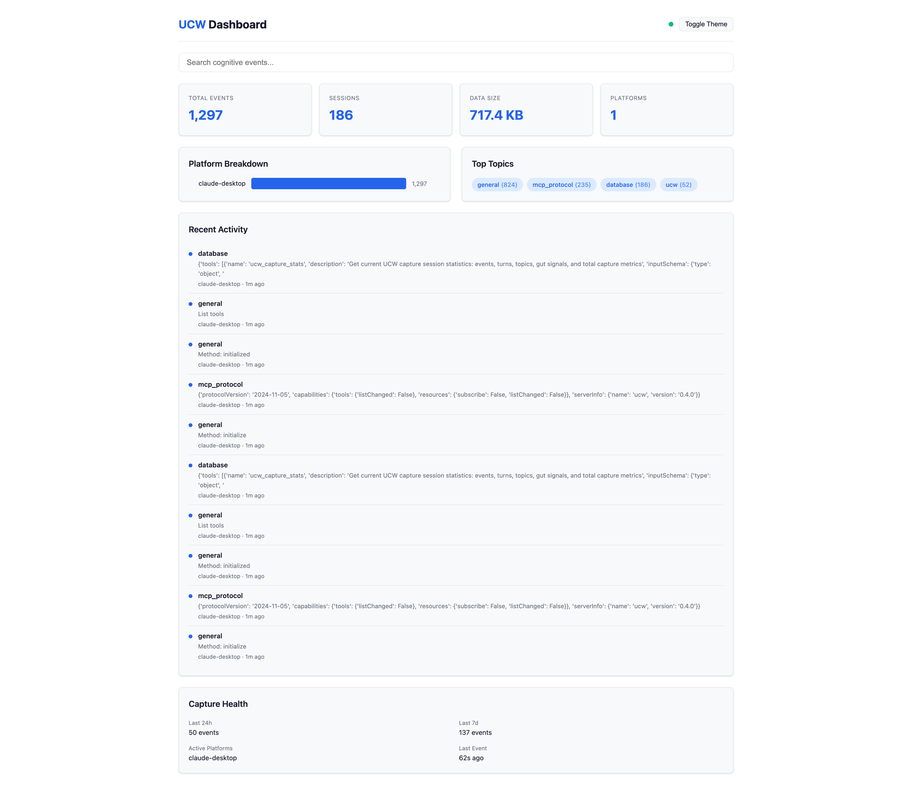
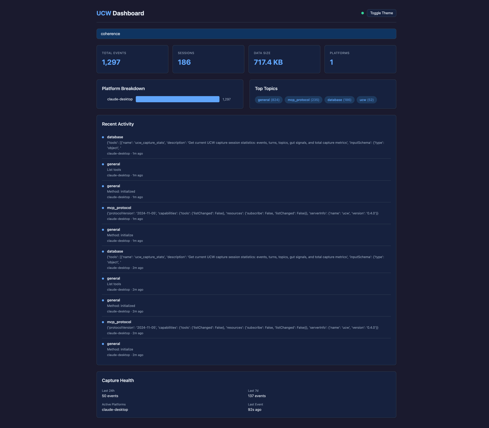

<p align="center">
  
</p>

<div align="center">

</div>

<p align="center">


<a href="https://github.com/Dicoangelo"></a>
</p>


## What Is This?

UCW captures and connects your conversations across AI tools — Claude, ChatGPT, Cursor, Grok. Instead of losing context when you switch platforms, UCW **remembers everything and finds the connections you'd miss**. All data stays local in SQLite. No cloud. No subscriptions.


## Architecture



## Project Structure

```
ucw/
├── src/ucw/
│   ├── cli.py              # 14 CLI commands (click)
│   ├── search.py            # FTS5 keyword + semantic vector search
│   ├── web.py               # Local web server (stdlib http.server)
│   ├── web_ui.py            # Embedded SPA (HTML/CSS/JS)
│   ├── dashboard.py         # Dashboard data aggregation
│   ├── config.py            # Configuration & paths
│   ├── demo.py              # Sample data generator
│   ├── errors.py            # Error hierarchy with hints
│   ├── db/
│   │   ├── sqlite.py        # CaptureDB, schema, WAL mode
│   │   ├── schema.sql       # Core schema (events, sessions, moments)
│   │   └── migrations/      # 001-007 incremental migrations
│   ├── server/
│   │   ├── server.py        # MCP protocol server
│   │   ├── bridge.py        # UCWBridgeAdapter (enrichment)
│   │   ├── embeddings.py    # sentence-transformers wrapper
│   │   └── router.py        # Tool routing
│   ├── tools/               # 23 MCP tools across 7 modules
│   │   ├── ucw_tools.py     # Capture stats, timeline, context
│   │   ├── coherence_tools.py  # Search, moments, arcs
│   │   ├── graph_tools.py   # Knowledge graph queries
│   │   ├── intelligence_tools.py  # Emergence, alerts
│   │   ├── temporal_tools.py  # Time-based patterns
│   │   ├── agent_tools.py   # Cross-agent memory, trust
│   │   └── proof_tools.py   # Hash chains, Merkle receipts
│   └── importers/           # ChatGPT, Cursor, Grok adapters
├── tests/                   # 565+ tests
├── visual_assets/           # Dashboard screenshots
└── pyproject.toml           # Hatch build, optional deps
```


## Features

<table>
<tr>
<td width="33%" align="center">
<h3>Semantic Search</h3>
<b>Find anything across all your AI tools</b>
<p><code>ucw search "that auth conversation"</code> with FTS5 keyword + sentence-transformer embeddings. Cached vectors mean instant repeat queries.</p>
<code>FTS5</code> <code>BM25</code> <code>cosine similarity</code>
</td>
<td width="33%" align="center">
<h3>Live Capture</h3>
<b>Every message, automatically</b>
<p>MCP server captures every Claude conversation in real-time. Nanosecond timestamps, intent detection, topic extraction, coherence signals.</p>
<code>MCP</code> <code>stdio</code> <code>zero-latency</code>
</td>
<td width="33%" align="center">
<h3>Web Dashboard</h3>
<b>Your AI memory at a glance</b>
<p><code>ucw web</code> launches a local SPA with search, platform breakdown, knowledge graph, coherence moments. Dark/light themes.</p>
<code>localhost:7077</code> <code>no npm</code> <code>zero deps</code>
</td>
</tr>
<tr>
<td width="33%" align="center">
<h3>Knowledge Graph</h3>
<b>See how ideas connect</b>
<p>Entities extracted from conversations form a graph. Relationships emerge across platforms — concepts that link your Claude work to ChatGPT research.</p>
<code>entities</code> <code>relationships</code> <code>force-directed</code>
</td>
<td width="33%" align="center">
<h3>Coherence Detection</h3>
<b>Cross-platform insight moments</b>
<p>UCW detects when the same concept appears across different AI tools — the "aha" moments where your thinking converges.</p>
<code>cross-platform</code> <code>moments</code> <code>arcs</code>
</td>
<td width="33%" align="center">
<h3>Proof of Cognition</h3>
<b>Cryptographic receipts for your AI work</b>
<p>SHA-256 hash chains and Merkle trees prove when ideas were captured. Timestamp your intellectual property.</p>
<code>SHA-256</code> <code>Merkle</code> <code>immutable</code>
</td>
</tr>
</table>

## Quick Start

```bash
pip install ucw                    # Core (CLI + capture)
ucw init                           # Set up ~/.ucw/ and detect AI tools
ucw demo                           # Load 52 sample events to explore
ucw dashboard                      # See your AI memory overview
ucw search "authentication"        # Search across all conversations
ucw web                            # Launch web dashboard at localhost:7077
```

### Connect to Claude (live capture)

```bash
ucw mcp-config                     # Print the MCP config JSON
```

Paste into **Claude Desktop** (Settings > Developer > Edit Config) or **Claude Code** (`.claude/settings.json`).

### Optional extras

```bash
pip install "ucw[embeddings]"      # Semantic search (sentence-transformers)
pip install "ucw[ui]"              # Rich terminal dashboard
pip install "ucw[all]"             # Everything
```

### Import existing conversations

```bash
ucw import chatgpt ~/Downloads/conversations.json
ucw import cursor                  # Auto-detects Cursor workspace DB
ucw import grok ~/Downloads/grok-export.json
```

## Commands

| Command | Description |
|---------|-------------|
| `ucw init` | Set up UCW and detect installed AI tools |
| `ucw server` | Start the MCP server (used by Claude) |
| `ucw search QUERY` | Search conversations with `--platform`, `--after`, `--before`, `--semantic` |
| `ucw web` | Launch web dashboard at `localhost:7077` |
| `ucw dashboard` | Terminal dashboard with platform breakdown and topics |
| `ucw index` | Build/manage semantic search embedding cache |
| `ucw capture-test` | Verify the full capture pipeline is working |
| `ucw import <platform>` | Import from ChatGPT, Cursor, or Grok |
| `ucw demo` | Load sample data to explore features |
| `ucw status` | Quick database statistics |
| `ucw doctor` | Check installation health |
| `ucw repair` | Fix and optimize the database (VACUUM) |
| `ucw migrate` | Run database schema migrations |
| `ucw mcp-config` | Print Claude MCP configuration JSON |

## 23 MCP Tools

When connected to Claude, UCW provides 23 tools across 7 categories:

| Category | Tools | Purpose |
|----------|-------|---------|
| **Capture** | `capture_stats`, `timeline`, `session_context` | Session tracking and event replay |
| **Coherence** | `search`, `status`, `moments`, `scan`, `arcs` | Cross-platform insight detection |
| **Intelligence** | `emergence`, `event_stream`, `alerts` | Real-time pattern recognition |
| **Graph** | `knowledge_graph`, `entity_relationships` | Entity extraction and linking |
| **Temporal** | `time_patterns`, `decay_detection`, `activity_map` | Time-based analysis |
| **Agent** | `cross_agent_memory`, `trust_scoring` | Multi-agent coordination |
| **Proof** | `hash_chain`, `merkle_tree`, `receipt` | Cryptographic proof-of-cognition |

## Tech Stack

| Layer | Technology | Purpose |
|-------|-----------|---------|
| **Runtime** | Python 3.10+ | Zero-dependency core (only `click`) |
| **Storage** | SQLite + FTS5 | WAL mode, local-only, nanosecond timestamps |
| **Protocol** | MCP (stdio) | Model Context Protocol for Claude integration |
| **Search** | FTS5 + sentence-transformers | BM25 keyword + cosine similarity vectors |
| **Web** | stdlib `http.server` | Single-file SPA, no npm, no build step |
| **Embeddings** | sentence-transformers (optional) | Cached in SQLite BLOB, 1.5KB per event |
| **Testing** | pytest + ruff | 565+ tests, zero lint errors |

## Web Dashboard

<p align="center">
  
  
</p>

## Configuration

UCW stores everything in `~/.ucw/`. Override with environment variables:

| Variable | Default | Description |
|----------|---------|-------------|
| `UCW_DATA_DIR` | `~/.ucw` | Data directory |
| `UCW_LOG_LEVEL` | `DEBUG` | Log level |
| `UCW_PLATFORM` | `claude-desktop` | Platform identifier |

## Requirements

- Python 3.10+
- SQLite 3.35+ (included with Python)

## Development

```bash
git clone https://github.com/Dicoangelo/ucw.git
cd ucw
pip install -e ".[dev]"
pytest                    # 565+ tests
ruff check .              # lint
ucw demo && ucw web       # visual smoke test
```

<details>
<summary><b>Build Log — v0.4.0</b></summary>

| Metric | v0.1.0 | v0.2.0 | v0.3.0 | v0.4.0 |
|--------|--------|--------|--------|--------|
| MCP Tools | 7 | 8 | 23 | 23 |
| CLI Commands | 3 | 4 | 10 | 14 |
| Tests | 63 | 153 | 469 | 565+ |
| Migrations | 0 | 0 | 5 | 7 |
| Importers | 0 | 0 | 3 | 3 |

**v0.4.0 highlights:**
- Semantic search (`ucw search`) with FTS5 + embedding cache
- Web dashboard (`ucw web`) — local SPA, dark/light themes
- Capture verification (`ucw capture-test`) — pipeline health check
- Cached coherence search (replaced brute-force re-embedding)

</details>

## Vision

```
┌─────────────────────────────────────────────────┐
│                                                 │
│   Every AI conversation you've ever had         │
│   is a data point in your cognitive portfolio.   │
│                                                 │
│   UCW captures the value.                       │
│   You own the equity.                           │
│                                                 │
└─────────────────────────────────────────────────┘
```

## License

MIT

<p align="center">
<a href="https://github.com/Dicoangelo/ucw"></a>
<a href="https://metaventionsai.com"></a>
</p>

<p align="center">
  
</p>
